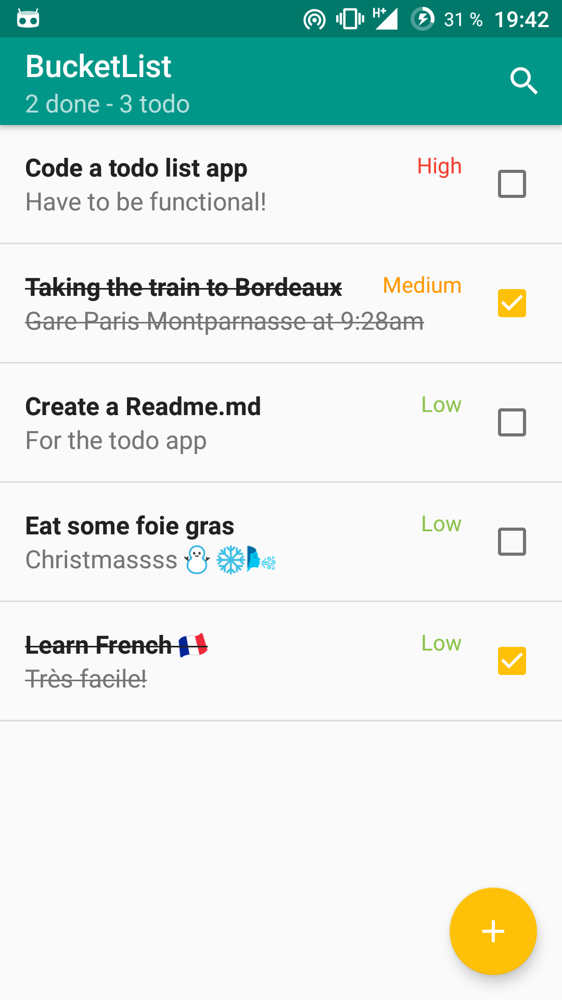
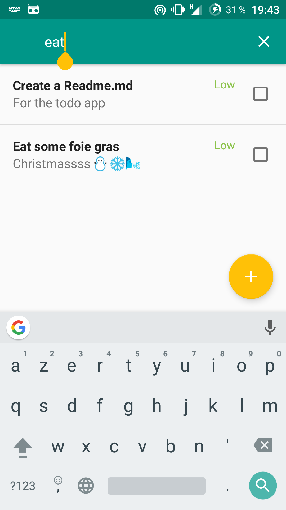
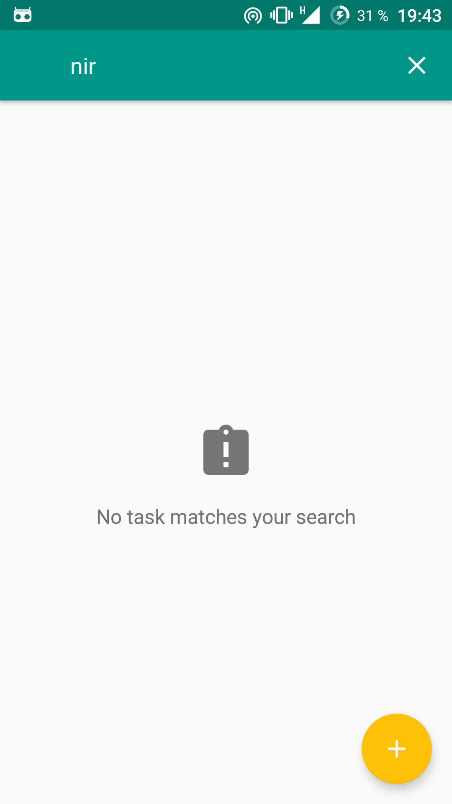
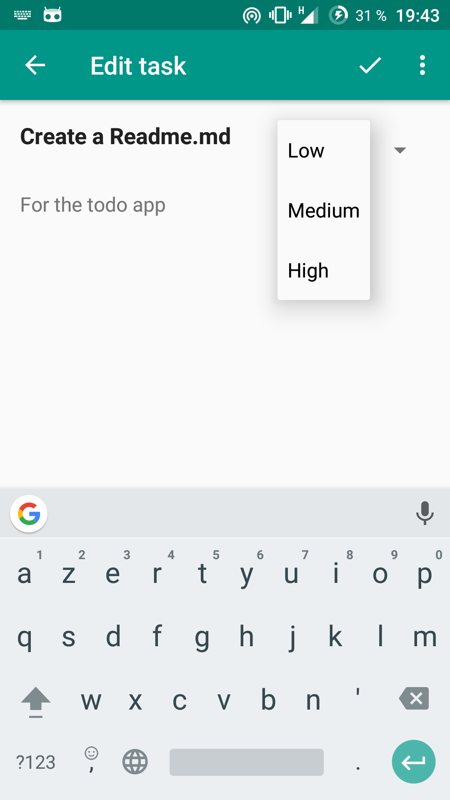

## BucketList ##

The app is developed with android studio. The minimum api is API 19, Android 4.4 KitKat.

It is a sample todo-list app. You can add/edit/delete a task composed of:

 - A title
 - A content
 - A priority
   
You can mark a task as done, undone. You can also search trough your list of task by title or content.

## Libraries ##

 - The support library for design and RecyclerView.
 - RxJava (1.x) & RxAndroid & RxBindings for reactive programming.
 - Realm (2.x) & Realm Adapters for storing and displaying data locally.
 - ConstraintLayout for some views.
 - TapTargetView for the material design discovery feature.

## Architecture ##

The app is using the MVP architecture.

## Icon ##

The icon of the app is taken from [Logdust](http://logodust.com/?giveaway) and resized with [Android Asset Studio](https://romannurik.github.io/AndroidAssetStudio/icons-launcher.html).